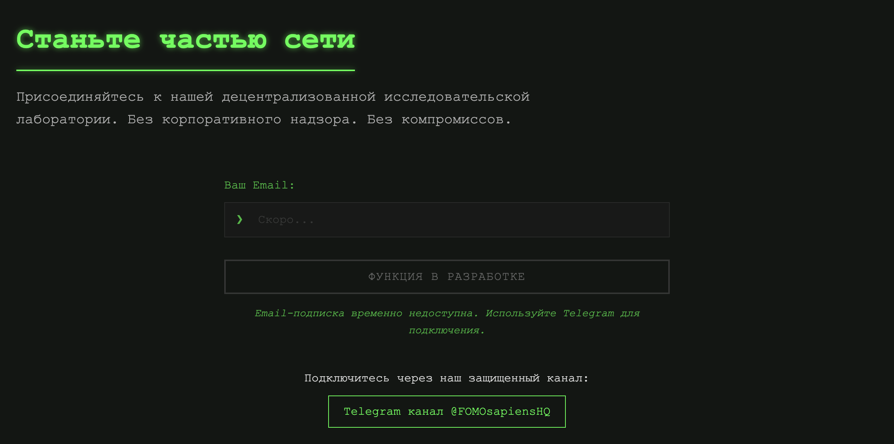
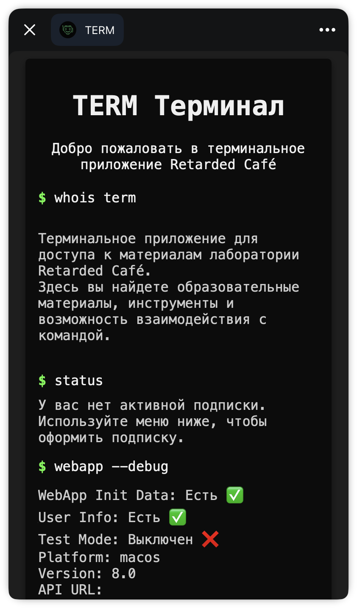
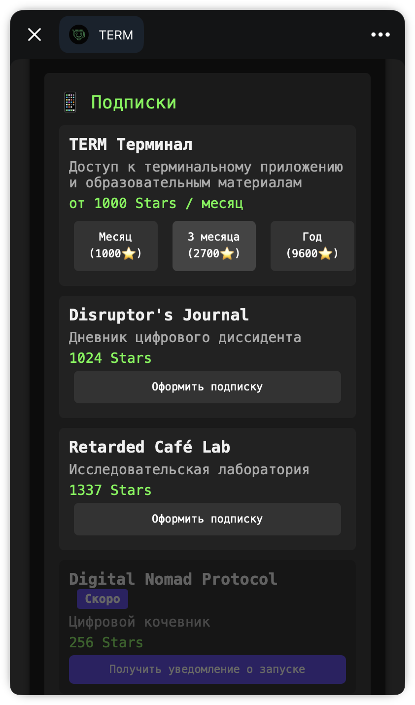

# TERM - Telegram Bot для Retarded Café

<p align="center">
  <pre style="color: #00FF00; background-color: #000000;">
  ████████╗███████╗██████╗ ███╗   ███╗
  ╚══██╔══╝██╔════╝██╔══██╗████╗ ████║
     ██║   █████╗  ██████╔╝██╔████╔██║
     ██║   ██╔══╝  ██╔══██╗██║╚██╔╝██║
     ██║   ███████╗██║  ██║██║ ╚═╝ ██║
     ╚═╝   ╚══════╝╚═╝  ╚═╝╚═╝     ╚═╝
  </pre>
</p>

<p align="center">
  <a href="https://retarded.cafe/#join">
    
  </a>
</p>

TERM - это Telegram бот с терминальным интерфейсом для проекта Retarded Café. Бот предоставляет доступ к образовательным материалам лаборатории, систему подписок и реферальную программу.

Попробовать бота: [@retarded_terminal_bot](https://t.me/retarded_terminal_bot)

## Особенности

- 🖥️ Терминальный интерфейс с зеленым текстом на черном фоне
- 💳 Интеграция с Telegram Payments API и Yookassa
- 🔄 Система подписок с разными уровнями доступа
- 👥 Реферальная система с бонусами
- 📚 Доступ к образовательным материалам на основе уровня подписки
- 🖱️ Интеграция с Telegram Mini Apps
- 🔧 Панель администратора для управления ботом

## Технические требования

- Node.js 16 или выше
- MongoDB 5 или выше
- Telegram Bot Token (получается через [@BotFather](https://t.me/BotFather))
- Для платежей: Telegram Payment Provider Token

## Установка

1. Клонирование репозитория:

```bash
git clone https://github.com/retarded-cafe/term-bot.git
cd term-bot
```

2. Установка зависимостей:

```bash
npm install
```

3. Настройка окружения:

Создайте файл `.env` в корне проекта и добавьте следующие переменные:

```
# Telegram Bot Configuration
BOT_TOKEN=your_telegram_bot_token
WEBHOOK_URL=https://your-webhook-url.com  # Опционально, для webhook
WEBHOOK_PORT=8443                         # Порт для webhook сервера

# Database Configuration
MONGODB_URI=mongodb://localhost:27017/term-bot

# Payment Configuration
PAYMENT_PROVIDER_TOKEN=your_payment_provider_token
YOOKASSA_SHOP_ID=your_yookassa_shop_id
YOOKASSA_SECRET_KEY=your_yookassa_secret_key

# Mini-App Configuration
MINI_APP_URL=https://your-mini-app-url.com

# Admin Configuration
ADMIN_USER_IDS=123456789,987654321        # Telegram ID администраторов, через запятую
```

## Запуск

### Локальный запуск

```bash
# Режим разработки с hot-reload
npm run dev

# Режим production
npm start
```

### Docker

> ⚠️ **Примечание от RC**: Мы категорически не рекомендуем использовать Docker для запуска бота. Docker не только усложняет архитектуру и создает дополнительные точки отказа, но и несет серьезные риски безопасности:
> - Уязвимости в базовых образах и зависимостях
> - Риски утечки данных через общие ресурсы контейнера
> - Сложности с обновлением безопасности в production
> - Потенциальные атаки через Docker daemon
> - Проблемы с изоляцией и правами доступа
>
> Предпочтительнее использовать прямой запуск через Node.js, что обеспечивает лучший контроль над безопасностью и производительностью.

Если вы все же хотите использовать Docker:

```bash
# Сборка и запуск через docker-compose
docker-compose up -d
```

## Настройка бота в BotFather

1. Создайте нового бота в [@BotFather](https://t.me/BotFather) с помощью команды `/newbot`
2. Получите токен бота
3. Настройте команды бота:

```
start - Начать работу с ботом
help - Список доступных команд
status - Проверить статус подписки
subscribe - Управление подпиской
content - Образовательные материалы
referral - Получить реферальную ссылку
miniapp - Открыть мини-приложение
admin - Панель администратора (только для админов)
```

4. Для настройки платежей:
   - Используйте команду `/mybots`, выберите вашего бота
   - Выберите "Payments"
   - Выберите платежную систему (Yookassa или другую)
   - Следуйте инструкциям по настройке

## Структура проекта

```
term-bot/
├── src/                      # Исходный код
│   ├── config/               # Конфигурация и константы
│   ├── middleware/           # Middleware для бота
│   ├── models/               # Mongoose модели
│   ├── modules/              # Основные модули бота
│   │   ├── admin/           # Админ-панель и управление
│   │   ├── auth/            # Аутентификация пользователей
│   │   ├── content/         # Управление контентом
│   │   ├── miniapp/         # Интеграция с Mini Apps
│   │   └── payments/        # Платежи и подписки
│   ├── scripts/             # Вспомогательные скрипты
│   ├── utils/               # Общие утилиты
│   ├── index.js             # Точка входа
│   └── server.js            # Express сервер
├── mini-app/                # Исходный код Telegram Mini App
│   ├── src/                 # React/Vue компоненты
│   ├── public/              # Статические файлы
│   └── package.json         # Зависимости мини-приложения
├── public/                  # Статические файлы
├── .env                     # Переменные окружения
├── .gitignore              # Игнорируемые файлы
├── docker-compose.yml       # Docker Compose конфигурация
├── Dockerfile              # Docker конфигурация
├── package.json            # NPM конфигурация
└── README.md               # Документация проекта
```

## Безопасность

- Все секретные ключи и токены должны храниться в `.env` файле
- Используйте HTTPS для webhook URL
- Регулярно обновляйте зависимости
- Проверяйте права доступа для админ-функций
- Используйте rate limiting для API endpoints
- Валидируйте все входящие данные

## Миниприложение

<p align="center">
  
  
</p>

В репозитории уже содержится полный исходный код мини-приложения в директории `mini-app/`. Это полноценное веб-приложение на React/Vue, стилизованное под терминальный интерфейс и интегрированное с Telegram Mini Apps Platform.

Основные функции мини-приложения:
- Система подписок с разными уровнями (TERM Терминал, Disruptor's Journal, Retarded Café Lab)
- Интеграция с платежной системой
- Доступ к образовательным материалам
- Уведомления о новых материалах

## Лицензия

MIT

## Контакты

- Telegram канал: [@FOMOsapiensHQ](https://t.me/FOMOsapiensHQ)
- Веб-сайт: [retarded.cafe](https://retarded.cafe)
- Бот: [@retarded_terminal_bot](https://t.me/retarded_terminal_bot) 